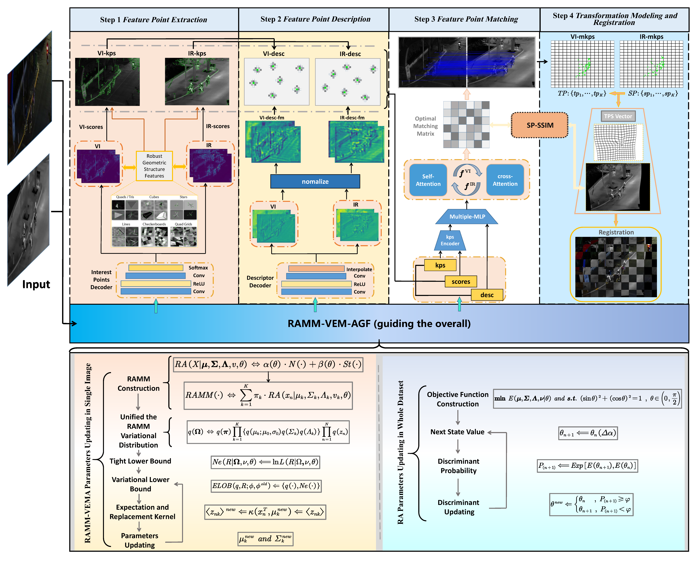

#  RA-MMIR
This repository contains training and evaluation code for RA-MMIR model with homography pairs generated from COCO dataset. 

## Introduction
RA-MMI is a Information Fusion 2024 research project done at PRAI.

<p align = "center">
  
</p>

SuperGlue operates as a "middle-end," performing context aggregation, matching, and filtering in a single end-to-end architecture. For more details, please see:

* Full paper PDF: [RA-MMIR : Multi-modal Image Registration by Robust Adaptive Variation Attention Gauge Field](https://www.sciencedirect.com/science/article/abs/pii/S1566253523005316).

* Authors: *Junhui Qiu, Hao Li, Hualong Cao, Xiangshuai Zhai, Xuedong Liu, Meng Sang, Kailong Yu, Yunpin Sun, Yang Yang, Pan Tan*

We provide two pre-trained weights files: 


##  Requirements
- torch>=1.8.1
- torch_scatter>=2.06
- matplotlib>=3.1.3
- opencv-python==4.1.2.30
- numpy>=1.18.1
- PyYAML>=5.4.1
- wandb (If logging of checkpoints to cloud is need)
- albumentations 

##  Training data
COCO 2017 dataset is used for training. Random homographies are generated at every iteration and matches are computed using the know homography matrix. Download the 'train2017', 'val2017', and 'annotations' folder of COCO 2017 dataset and put that path in the config file used for training.

##  Training

All the parameters of training are provided in the coco_config.yaml in the configs folder. Change that file inplace and start the training. Or clone that file to make the changes and mention the custom config path in training command. Parameters of training are explained in comments in the coco_config.yaml file. To start the training run,

  

    python train_RA_MMIR.py --config_path configs/coco_config.yaml

Incase of Multi-GPU training, distributed setting is used. So run the following command,

  

    python -m torch.distributed.launch --nproc_per_node="NUM_GPUS" train_RA_MMIR.py --config_path configs/coco_config.yaml

Only singe-node training is supported as of now.

Checkpoints are saved at the end of every epoch, and best checkpoint is determined by weighted score of AUC at different thresholds, precision and recall computed on COCO 2017 val dataset using random homographies. Validation score is computed on fixed set of images and homographies for consistency across runs. Image and homography info used for validation is present at assets/coco_val_images_homo.txt

  
##  Evaluation

The official implementation has evaluation code for testing on small set of scannet scene pairs. Since our model in trained with random homographies, evaluating on scenes with random 3D camera movements doesn't perform well as pretrained indoor model. Instead we evaluate on test images of COCO, dataset(https://dimlrgbd.github.io/) with random homographies. Images are selected from the datasets and random homographies are generated for each of them. Based on matches given by the model, we determine the homography matrix using DLT and RANSAC implementation. As mentioned in paper, we report the AUC at 5, 10, 25 thresholds(for corner points), precision and recall. For evaluation run the following command,

    python match_homography.py --eval --RA_MMIR coco_homo

Parameter --superglue determines the checkpoint used and should be one of the following,

  

- Use **coco_homo** to run with the released coco homography model

- Use **PATH_TO_YOUR_.PT** to run with your trained model

Add --viz flag to dump the matching info image to 'dump_homo_pairs' folder.

If you want to evaluate with scannet pairs, run the above command with match_pairs.py with same parameters

##  Evaluation Results

Following are the results on three different sets of COCO2017 test images, indoor images and outdoor images using randomly generated homographies at assets/coco_test_images_homo.txt, assets/indoor_test_images_homo.txt, assets/outdoor_test_images_homo.txt respectively.

##  Creating you own homography test set
Incase you want to generate your own test set with random homographies that is compatible with match_homography.py run the command `python3 get_perspective.py`.

All the parameters regarding the random homography range, input and output folder are mentioned in the file itself. While running the match_homography.py you should mention the additional parameters --input_homography and --input_dir that points to the generated homography text file and images directory respectively.

## BibTeX Citation
If you use any ideas from the paper or code from this repo, please consider citing:

```txt
@article{qiu2024ra,
  title={RA-MMIR: Multi-modal image registration by Robust Adaptive Variation Attention Gauge Field},
  author={Qiu, Junhui and Li, Hao and Cao, Hualong and Zhai, Xiangshuai and Liu, Xuedong and Sang, Meng and Yu, Kailong and Sun, Yunpin and Yang, Yang and Tan, Pan},
  journal={Information Fusion},
  volume={105},
  pages={102215},
  year={2024},
  publisher={Elsevier}
}
```

## Credits
- https://github.com/gouthamvgk/SuperGlue_training - Training code is adapted from this repo
- https://github.com/magicleap/SuperGluePretrainedNetwork - Training code is adapted from this official repo
- 